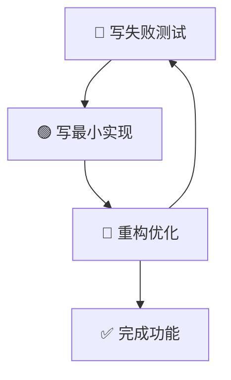

# 🧪 测试计划文档

## 📋 概述

**项目**：语言学习平台 (Easiest Language)  
**版本**：MVP v1.0  
**测试方法**：测试驱动开发 (TDD)  
**覆盖率目标**：90%+

## 🎯 测试目标

### 主要目标

- **质量保证**：确保所有功能按预期工作
- **回归预防**：防止新代码破坏现有功能
- **性能验证**：确保应用性能符合要求
- **用户体验**：保证用户交互流畅可靠

### 成功标准

- 单元测试覆盖率 ≥ 90%
- 集成测试覆盖核心用户流程
- E2E测试覆盖关键业务场景
- 所有测试用例通过率 100%

## 🏗️ 测试架构

### 测试金字塔结构

```
    🏠 E2E 测试 (10%)
   ----------------------
  🔧 集成测试 (20%)
 ------------------------
🧱 单元测试 (70%)
```

### 测试分层策略

#### 1. 单元测试 (70%) - Jest + React Testing Library

- **工具函数测试**：数据处理、计算逻辑
- **组件测试**：React组件渲染和交互
- **Hook测试**：自定义Hook逻辑
- **类型安全**：TypeScript类型验证

#### 2. 集成测试 (20%) - Jest + React Testing Library

- **组件集成**：多组件协作
- **数据流测试**：状态管理和数据传递
- **API集成**：模拟API调用
- **路由测试**：页面导航和参数传递

#### 3. E2E测试 (10%) - Cypress

- **用户旅程**：完整的用户操作流程
- **跨浏览器**：主流浏览器兼容性
- **性能测试**：关键操作的性能
- **可访问性**：A11y合规性检查

## 📊 测试策略

### 测试驱动开发 (TDD) 流程



#### TDD三原则

1. **Red**：先写失败的测试用例
2. **Green**：写最少代码使测试通过
3. **Refactor**：重构代码保持质量

### 测试命名约定

```typescript
// 描述性测试命名
describe('LanguageCard组件', () => {
  describe('when rendering with valid data', () => {
    it('should display language name and difficulty', () => {
      // 测试实现
    });
  });

  describe('when user clicks the card', () => {
    it('should navigate to language detail page', () => {
      // 测试实现
    });
  });
});
```

## 🎭 测试场景

### 核心功能测试

#### 1. 语言数据展示

- **场景**：用户查看语言列表
- **测试点**：
  - 数据正确显示
  - 排序和筛选功能
  - 加载状态处理
  - 错误状态处理

#### 2. 语言详情查看

- **场景**：用户点击语言卡片查看详情
- **测试点**：
  - 详情页面正确渲染
  - 学习时间计算准确
  - 相关信息完整显示
  - 返回导航功能

#### 3. 交互功能

- **场景**：用户与界面交互
- **测试点**：
  - 按钮点击响应
  - 表单输入验证
  - 键盘导航支持
  - 移动端触摸交互

### 边界条件测试

#### 1. 数据边界

- 空数据状态
- 大量数据加载
- 异常数据格式
- 网络错误处理

#### 2. 用户交互边界

- 快速连续点击
- 无效输入处理
- 浏览器兼容性
- 设备适配

## 🛠️ 测试工具配置

### Jest配置优化

```javascript
// jest.config.js 关键配置
{
  testEnvironment: 'jsdom',
  setupFilesAfterEnv: ['<rootDir>/jest.setup.js'],
  collectCoverageFrom: [
    'src/**/*.{ts,tsx}',
    '!src/**/*.d.ts',
    '!src/**/*.test.{ts,tsx}',
    '!src/**/*.stories.{ts,tsx}'
  ],
  coverageThreshold: {
    global: {
      branches: 90,
      functions: 90,
      lines: 90,
      statements: 90
    }
  }
}
```

### Cypress配置

```typescript
// cypress.config.ts 关键配置
{
  e2e: {
    baseUrl: 'http://localhost:3000',
    viewportWidth: 1280,
    viewportHeight: 720,
    video: false,
    screenshotOnRunFailure: true
  }
}
```

## 📋 测试用例模板

### 单元测试模板

```typescript
import { render, screen } from '@/lib/utils/test-utils';
import { ComponentName } from './ComponentName';
import { mockTestData } from '@/lib/__mocks__/test-data';

describe('ComponentName', () => {
  beforeEach(() => {
    // 测试前准备
  });

  afterEach(() => {
    // 测试后清理
  });

  describe('基础渲染', () => {
    it('应该正确渲染组件', () => {
      // Arrange
      const props = { ...mockTestData };

      // Act
      render(<ComponentName {...props} />);

      // Assert
      expect(screen.getByRole('...')).toBeInTheDocument();
    });
  });

  describe('用户交互', () => {
    it('应该响应用户点击', async () => {
      // AAA模式测试
    });
  });

  describe('错误处理', () => {
    it('应该处理无效数据', () => {
      // 边界条件测试
    });
  });
});
```

### E2E测试模板

```typescript
describe('功能名称 E2E 测试', () => {
  beforeEach(() => {
    cy.visit('/');
  });

  it('应该完成核心用户旅程', () => {
    // Given - 初始状态
    cy.get('[data-testid="language-list"]').should('be.visible');

    // When - 用户操作
    cy.get('[data-testid="language-card"]').first().click();

    // Then - 验证结果
    cy.url().should('include', '/language/');
    cy.get('[data-testid="language-detail"]').should('be.visible');
  });
});
```

## 📊 测试数据管理

### Mock数据策略

#### 1. 静态Mock数据

- 存放在 `src/lib/__mocks__/test-data.ts`
- 覆盖不同测试场景
- 保持数据一致性

#### 2. 动态Mock数据

- 使用工厂函数生成
- 支持参数化定制
- 避免测试间干扰

#### 3. 外部依赖Mock

- API调用Mock
- 浏览器API Mock
- 第三方库Mock

### 数据隔离原则

```typescript
// 每个测试用例独立的数据
describe('Language List', () => {
  it('should render languages', () => {
    const mockData = generateTestData.mockLanguage();
    // 使用独立的mock数据
  });
});
```

## ⚡ 性能测试

### 关键指标

#### 1. 渲染性能

- 首次内容绘制 (FCP) < 1s
- 最大内容绘制 (LCP) < 2.5s
- 累积布局偏移 (CLS) < 0.1

#### 2. 交互性能

- 首次输入延迟 (FID) < 100ms
- 交互就绪时间 (TTI) < 5s

#### 3. 资源加载

- Bundle大小监控
- 代码分割效果
- 图片优化验证

### 性能测试实现

```typescript
// 性能测试示例
describe('Performance Tests', () => {
  it('should render quickly', async () => {
    const renderTime = await measureRenderTime(<LanguageList />);
    expect(renderTime).toBeLessThan(100); // 100ms以内
  });
});
```

## 🛡️ 质量保证

### 代码质量检查

#### 1. 静态分析

- ESLint: 代码规范检查
- TypeScript: 类型安全
- Prettier: 代码格式化

#### 2. 测试质量

- 覆盖率报告
- 变更测试
- 测试代码审查

### 持续集成 (CI)

```yaml
# GitHub Actions 测试流程
name: Test Suite
on: [push, pull_request]
jobs:
  test:
    runs-on: ubuntu-latest
    steps:
      - name: Run Tests
        run: |
          npm run test:unit
          npm run test:integration
          npm run test:e2e
      - name: Coverage Report
        run: npm run test:coverage
```

## 📅 测试计划时间表

### 开发阶段测试

| 阶段     | 时间分配 | 测试重点     |
| -------- | -------- | ------------ |
| 需求分析 | 10%      | 测试用例设计 |
| 开发实现 | 60%      | TDD实施      |
| 集成测试 | 20%      | 功能集成     |
| 验收测试 | 10%      | E2E验证      |

### 里程碑检查点

- **Week 1**: 测试环境搭建完成
- **Week 2**: 核心功能单元测试完成
- **Week 3**: 集成测试完成
- **Week 4**: E2E测试和性能优化完成

## 🚀 最佳实践

### 测试编写原则

#### 1. FIRST原则

- **Fast**: 测试运行快速
- **Independent**: 测试相互独立
- **Repeatable**: 测试可重复执行
- **Self-Validating**: 测试结果明确
- **Timely**: 测试及时编写

#### 2. AAA模式

- **Arrange**: 准备测试数据
- **Act**: 执行被测试代码
- **Assert**: 验证结果

#### 3. 清晰的测试描述

```typescript
// ❌ 不好的描述
it('should work', () => {});

// ✅ 好的描述
it('should display error message when API call fails', () => {});
```

### 常见陷阱避免

#### 1. 避免测试实现细节

```typescript
// ❌ 测试实现
expect(component.state.isLoading).toBe(true);

// ✅ 测试行为
expect(screen.getByText('Loading...')).toBeInTheDocument();
```

#### 2. 避免脆弱的选择器

```typescript
// ❌ 脆弱选择器
cy.get('.css-class-123');

// ✅ 稳定选择器
cy.get('[data-testid="language-card"]');
```

## 📈 测试指标监控

### 关键指标 (KPI)

- **测试覆盖率**: 目标 90%+
- **测试执行时间**: 单元测试 < 30s
- **缺陷发现率**: 90%+ 缺陷在开发阶段发现
- **测试维护成本**: 测试代码维护时间 < 20%开发时间

### 报告和监控

- 每日测试执行报告
- 覆盖率趋势分析
- 性能指标监控
- 缺陷趋势跟踪

---

## 🎯 结语

这个测试计划确保我们的语言学习平台具有高质量、高可靠性的代码。通过TDD方法，我们不仅保证功能的正确性，还确保代码的可维护性和扩展性。

**记住**：好的测试不仅是质量的保证，更是开发者信心的来源。
