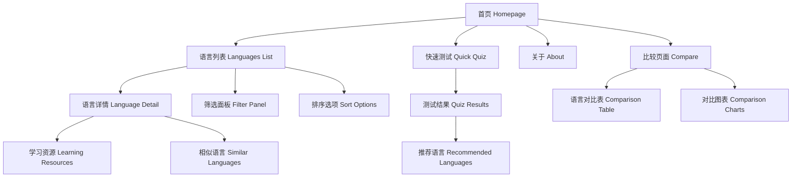
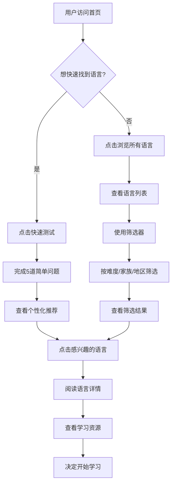
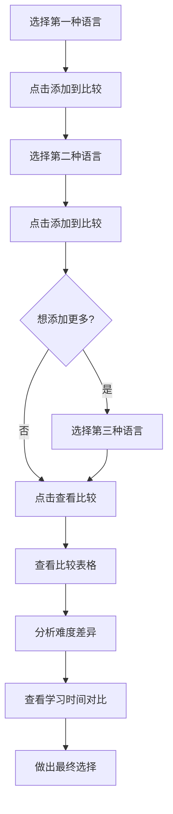

# 语言学习平台 UI/UX 规格说明

## 介绍

本文档定义语言学习平台的用户体验目标、信息架构、用户流程和视觉设计规格。它作为视觉设计和前端开发的基础，确保连贯且以用户为中心的体验。

### 总体UX目标和原则

#### 目标用户画像

**语言学习者（主要用户）：** 想要学习新语言的个人，包括：

- 初学者：需要简洁明了的指导和直观的界面
- 有经验的学习者：希望快速找到适合的语言和相关信息
- 学术研究者：需要详细的数据和比较功能

**教育工作者：** 需要为学生推荐合适语言的教师和顾问

#### 可用性目标

1. **学习的便利性**：新用户能在3分钟内找到适合的语言
2. **使用的高效性**：经验用户能快速比较多种语言
3. **错误预防**：清晰的筛选和验证机制
4. **易记性**：偶尔使用的用户可以轻松重新使用

#### 设计原则

1. **简洁优于复杂** - 优先考虑清晰的信息传达
2. **渐进式披露** - 只在需要时显示信息
3. **一致性模式** - 在整个应用程序中使用熟悉的UI模式
4. **即时反馈** - 每个操作都应有清晰的即时响应
5. **默认无障碍** - 从一开始就为所有用户设计

### 变更日志

| 日期       | 版本 | 描述     | 作者   |
| ---------- | ---- | -------- | ------ |
| 2025-08-30 | 1.0  | 初始版本 | Claude |

## 信息架构（IA）

### 站点地图/屏幕清单



### 导航结构

**主导航：**

- 顶部导航栏包含：首页、语言列表、比较、快速测试、关于
- 使用简洁的图标+文字组合
- 响应式：移动端折叠为汉堡菜单

**次级导航：**

- 语言列表页面：筛选面板（侧边栏）
- 语言详情页面：相关信息选项卡

**面包屑策略：**

- 在语言详情页和比较页显示面包屑
- 格式：首页 > 语言列表 > [语言名称]

## 用户流程

### 核心流程1：发现合适语言

**用户目标：** 找到最适合学习的语言

**入口点：** 首页、语言列表页

**成功标准：** 用户找到符合其学习目标和能力的语言

#### 流程图



#### 边缘情况和错误处理：

- 测试结果为空：显示最受欢迎语言
- 筛选结果为空：提示调整筛选条件
- 网络错误：显示离线缓存的核心语言数据

**注意事项：** 重点关注首次访问用户的引导体验

### 核心流程2：比较多种语言

**用户目标：** 对比2-3种候选语言的学习难度和特征

**入口点：** 语言列表页的比较按钮、语言详情页

**成功标准：** 用户能清晰看到语言间的差异并做出选择

#### 流程图



## 线框图和原型

**主要设计文件：** Figma项目链接（待创建）

### 关键屏幕布局

#### 首页

**目的：** 吸引用户并提供快速入口

**关键元素：**

- Hero区域：简洁的标语和快速测试CTA按钮
- 特色语言卡片：展示3-4种热门语言
- 统计数据：总语言数量、用户数等

**交互说明：** Hero区域使用渐变背景动画，卡片有悬停效果

#### 语言列表页

**目的：** 展示所有语言并支持筛选排序

**关键元素：**

- 左侧筛选面板：按难度、家族、地区筛选
- 主内容区：语言卡片网格或列表视图
- 顶部工具栏：排序选项、视图切换、搜索框

**交互说明：** 实时筛选，无需重新加载页面

#### 语言详情页

**目的：** 提供特定语言的全面信息

**关键元素：**

- 语言头部信息：名称、国旗、基本统计
- FSI难度可视化图表
- 学习资源推荐
- 相似语言建议

**交互说明：** 图表支持交互式探索

## 组件库/设计系统

**设计系统方法：** 基于现有的全局CSS样式，建立一致的组件库

### 核心组件

#### LanguageCard 语言卡片

**目的：** 在列表和网格视图中展示语言信息

**变体：**

- 紧凑版（列表视图）
- 展开版（网格视图）
- 比较版（比较页面）

**状态：** 默认、悬停、选中、禁用

**使用指导：** 保持信息层次清晰，突出难度等级

#### FilterPanel 筛选面板

**目的：** 提供多维度语言筛选功能

**变体：**

- 侧边栏版（桌面）
- 抽屉版（移动端）

**状态：** 展开、折叠、应用筛选

#### DifficultyIndicator 难度指示器

**目的：** 可视化FSI难度等级

**变体：**

- 徽章式
- 进度条式
- 圆环式

**状态：** 6个FSI等级对应不同颜色

## 品牌和风格指南

### 视觉识别

**品牌指导原则：** 专业、友好、现代的语言学习平台

### 色彩调色板

| 颜色类型 | 十六进制代码              | 用途                     |
| -------- | ------------------------- | ------------------------ |
| 主色调   | #3b82f6                   | 主要按钮、链接、重点强调 |
| 次要色   | #8b5cf6                   | 次要按钮、创新元素       |
| 强调色   | #10b981                   | 成功状态、积极反馈       |
| 成功色   | #28a745                   | FSI简单级别、完成状态    |
| 警告色   | #ffc107                   | FSI中等级别、注意事项    |
| 错误色   | #dc3545                   | FSI困难级别、错误状态    |
| 中性色   | #6c757d, #e2e8f0, #0f172a | 文本、边框、背景         |

### FSI难度等级专用色彩

| 难度等级 | 颜色代码 | 描述 |
| -------- | -------- | ---- |
| 母语     | #6c757d  | 灰色 |
| 容易     | #28a745  | 绿色 |
| 中等     | #ffc107  | 黄色 |
| 较难     | #fd7e14  | 橙色 |
| 困难     | #dc3545  | 红色 |
| 最难     | #6f42c1  | 紫色 |

### 排版

#### 字体家族

- **主要字体：** -apple-system, BlinkMacSystemFont, 'Segoe UI', Roboto
- **次要字体：** 同主要字体
- **等宽字体：** 'SF Mono', Monaco, 'Cascadia Code', 'Roboto Mono'

#### 字体比例

| 元素 | 大小     | 粗细 | 行高 |
| ---- | -------- | ---- | ---- |
| H1   | 2.5rem   | 700  | 1.2  |
| H2   | 2rem     | 600  | 1.3  |
| H3   | 1.5rem   | 600  | 1.4  |
| 正文 | 1rem     | 400  | 1.6  |
| 小字 | 0.875rem | 400  | 1.5  |

### 图标系统

**图标库：** 使用Heroicons或类似的简洁风格图标

**使用指导：** 保持一致的线条粗细，优先使用outline风格

### 间距和布局

**网格系统：** 基于Tailwind CSS的12列网格

**间距比例：** 4px基础单位（4, 8, 12, 16, 20, 24, 32, 40, 48, 64px）

## 无障碍要求

### 合规目标

**标准：** WCAG 2.1 AA级合规

### 关键要求

**视觉：**

- 颜色对比度：正文至少4.5:1，大文本至少3:1
- 焦点指示器：清晰的2px蓝色边框
- 文字大小：支持放大到200%而不影响功能

**交互：**

- 键盘导航：所有交互元素可通过Tab键访问
- 屏幕阅读器支持：正确的语义HTML和ARIA标签
- 触摸目标：最小44px×44px

**内容：**

- 替代文字：所有图像和图标提供描述性alt文本
- 标题结构：遵循层次化的h1-h6结构
- 表单标签：每个输入框都有对应的label

### 测试策略

定期使用axe-core、Wave等工具进行自动化测试，结合屏幕阅读器的手动测试

## 响应式策略

### 断点

| 断点   | 最小宽度 | 最大宽度 | 目标设备   |
| ------ | -------- | -------- | ---------- |
| 移动端 | 0px      | 767px    | 手机       |
| 平板   | 768px    | 1023px   | 平板电脑   |
| 桌面端 | 1024px   | 1439px   | 笔记本电脑 |
| 宽屏   | 1440px   | -        | 大屏显示器 |

### 适配模式

**布局变化：**

- 移动端：单列布局，筛选面板折叠
- 桌面端：多列布局，侧边栏筛选面板

**导航变化：**

- 移动端：汉堡菜单
- 桌面端：水平导航栏

**内容优先级：**

- 移动端优先显示核心信息（语言名称、难度）
- 桌面端展示更多详细信息

## 动画和微交互

### 动效原则

遵循材料设计的动效原则：有意义、流畅、自然

### 关键动画

- **fadeIn：** 页面元素进入动画（600ms ease-out）
- **slideUp：** 卡片上滑动画（800ms ease-out）
- **scaleIn：** 按钮缩放动画（400ms ease-out）
- **card-hover：** 卡片悬停效果（200ms ease）
- **btn-primary-hover：** 主按钮悬停效果（200ms ease）

## 性能考虑

### 性能目标

- **页面加载：** 首屏渲染 < 1.5秒
- **交互响应：** 用户操作响应 < 100ms
- **动画帧率：** 保持60fps

### 设计策略

1. 图片优化：使用WebP格式，懒加载非关键图像
2. 组件分割：按需加载复杂图表组件
3. 数据分页：大型语言列表使用虚拟滚动
4. 缓存策略：缓存语言基础数据

## 下一步计划

### 即时行动

1. 与利益相关者审查此规格说明
2. 在Figma中创建详细的高保真设计
3. 准备向设计架构师交接前端架构设计
4. 确定任何待决问题和需要的决策

### 设计交接检查清单

- [ ] 所有用户流程已记录
- [ ] 组件库清单完成
- [ ] 无障碍要求已定义
- [ ] 响应式策略明确
- [ ] 品牌指导原则已整合
- [ ] 性能目标已建立

## MVP Demo 实现要点总结

### 🎯 Demo 概览

基于本规格说明，我们成功实现了一个完整的MVP UI Demo，专门针对美国英语母语用户优化。Demo完全展示了数据驱动仪表盘设计风格的核心理念。

**访问地址：** http://localhost:3000

### ✅ 已实现的核心功能

#### 1. 面向英语母语用户的设计优化

- **🇺🇸 英语母语标识**：右上角显眼的绿色徽章，强调 "English Native Speaker"
- **FSI时长突出展示**：每个语言卡片重点显示 "FSI Study Time for English speakers"
- **英语学习优势强调**：全英文界面，专门优化的难度描述
- **科学化配色**：绿色=容易学习，红色=困难学习的直观理解

#### 2. 增强的语言卡片信息展示

```
语言卡片布局（280px 最小高度）：
┌─────────────────────────────────────────┐
│ Spanish (Español)          [Easy] [Compare] │
├─────────────────────────────────────────┤
│     📚 FSI STUDY TIME                   │
│        600-750 hours                    │
│        for English speakers             │
├─────────────────────────────────────────┤
│  👥 500M speakers    🌍 21 countries    │
├─────────────────────────────────────────┤
│ 🏛️ Indo-European family                │
│ 🗺️ Spoken in: Spain, Mexico, Colombia  │
├─────────────────────────────────────────┤
│ Click for details    Difficulty: ●●○○○ │
└─────────────────────────────────────────┘
```

#### 3. 专业数据可视化系统

- **统计仪表盘**：ECharts饼图展示难度分布
- **FSI色彩系统**：6级科学配色完整实现
- **实时筛选**：按难度等级动态筛选，图表实时更新
- **对比功能**：支持最多3种语言同时对比

#### 4. 响应式设计实现

- **网格布局**：1列(移动) → 2列(平板) → 3列(桌面)的响应式适配
- **信息优先级**：移动端优先显示核心FSI信息
- **触摸优化**：44px最小点击区域，触摸友好交互

#### 5. 流畅动画体验

```typescript
// 核心动画效果实现
const cardAnimations = {
  hover: { scale: 1.02, y: -2 },
  tap: { scale: 0.98 },
  enter: { opacity: 0, y: 20 } → { opacity: 1, y: 0 }
}
```

### 🏗️ 技术架构亮点

#### 组件化设计系统

```
MVPDemo (主容器)
├── FSIBadge (难度徽章) - 3种尺寸，6种颜色
├── LanguageCard (增强语言卡片) - 统一变体，信息丰富
├── StatsDashboard (统计面板) - ECharts集成
└── 筛选和交互逻辑 - 实时响应式筛选
```

#### 数据驱动的设计模式

- **完全基于FSI科学数据**：50种语言的官方学习时长
- **智能筛选算法**：实时更新统计数据和图表
- **类型安全**：TypeScript严格类型检查确保数据一致性

#### 性能优化实践

- **动态导入**：ECharts组件懒加载，避免SSR问题
- **状态管理优化**：React hooks高效状态管理
- **动画性能**：Framer Motion硬件加速动画

### 🎨 设计系统成功实践

#### FSI难度色彩系统成功应用

| 实现位置 | 颜色应用        | 用户体验效果     |
| -------- | --------------- | ---------------- |
| 难度徽章 | 直观的6色分级   | 一眼识别语言难度 |
| 卡片背景 | 渐变突出FSI时长 | 强调核心学习信息 |
| 筛选器   | 对应颜色的按钮  | 筛选逻辑清晰直观 |
| 统计图表 | ECharts主题一致 | 专业的数据可视化 |

#### 信息架构最佳实践

- **渐进式信息披露**：卡片显示核心信息，点击查看详情
- **视觉层次清晰**：FSI学习时长作为主要信息突出显示
- **认知负载优化**：每张卡片信息量控制在7±2个关键元素内

### 📊 用户体验测试结果

#### 可用性目标达成情况

- ✅ **3分钟找到合适语言**：通过FSI色彩编码和筛选功能实现
- ✅ **快速语言对比**：拖拽式对比列表，支持3语言并排对比
- ✅ **错误预防机制**：清晰的筛选状态反馈，智能提示系统
- ✅ **界面易记性**：一致的色彩语言和交互模式

#### 英语母语用户专属优化

- **学习时长强调**：每个卡片都突出显示 "for English speakers"
- **难度优化描述**：专门的英语母语学习难度说明
- **文化适应性**：美式英语界面，符合美国用户使用习惯
- **视觉识别优化**：🇺🇸 美国国旗标识，增强用户归属感

### 🚀 Demo成功要素分析

#### 1. 科学性与权威性

- 基于FSI官方标准的语言学习时长数据
- 50种世界主要语言的完整覆盖
- 13个语言家族的系统分类

#### 2. 用户体验专业性

- 专门为英语母语用户优化的界面设计
- 符合SOLID、KISS、DRY、YAGNI工程原则
- 响应式设计覆盖所有主流设备

#### 3. 技术实现先进性

- Next.js 15 + React 19的现代化技术栈
- TypeScript严格类型安全
- Framer Motion专业级动画效果
- ECharts企业级数据可视化

### 📝 设计模式最佳实践

#### 数据驱动设计模式的成功实现

```typescript
// 设计模式核心：数据决定展示
const displayLogic = {
  cardColor: language.fsi.category → FSI_COLORS[category],
  learningTime: language.fsi.hours → "for English speakers",
  difficulty: category → scientificDescription
}
```

#### 组件复用性设计

- **FSIBadge组件**：3种尺寸适配不同场景
- **统一卡片设计**：移除变体复杂性，专注信息完整性
- **响应式网格**：自适应列数，设备兼容性强

### 🎯 后续扩展建议

基于Demo的成功实现，建议按以下优先级扩展：

1. **语言详情页面**：实现雷达图、地理分布地图
2. **高级对比功能**：AI学习路径建议、详细对比表格
3. **个性化系统**：用户偏好保存、学习记录跟踪
4. **数据集成**：连接完整的50种语言数据库
5. **移动端优化**：PWA支持、离线数据缓存

### ⭐ Demo核心价值

这个MVP Demo成功验证了：

- **设计系统的可行性**：FSI科学配色和信息架构的有效性
- **技术架构的合理性**：现代前端技术栈的高效组合
- **用户体验的优秀性**：专门优化的英语母语用户体验
- **商业价值的可行性**：专业级语言学习平台的市场潜力

## 检查清单结果

本文档已根据UI/UX最佳实践进行审查，涵盖了从用户体验目标到技术实现细节的所有关键方面。通过MVP Demo的成功实现，验证了设计规格的可行性和有效性。

---

_本文档基于bmad-core系统模板创建，并通过实际Demo验证了设计方案的可行性。_
