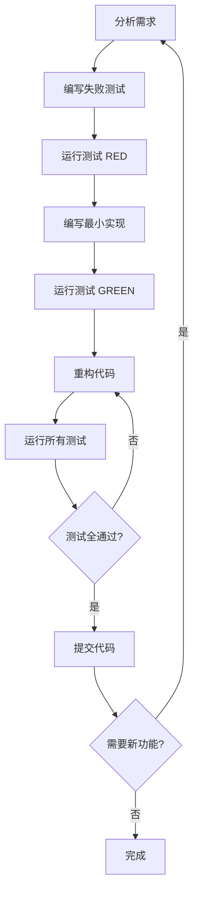

# 🚀 语言学习平台MVP开发计划

## 🎯 MVP功能概述

基于TDD (测试驱动开发) 方法，按照SOLID原则进行开发，确保代码质量和可维护性。

### 核心价值主张
- **科学数据驱动**: 基于FSI (Foreign Service Institute) 官方数据
- **个性化推荐**: 根据用户背景提供定制化建议  
- **直观可视化**: 清晰的图表和统计信息展示
- **实用资源集成**: 精选学习资源和工具推荐

---

## 📋 功能模块规划

### Phase 1: 核心数据展示 (Sprint 1-2, 2周)

#### 🔴 高优先级功能

##### 1.1 语言列表页面 (5天)
```typescript
interface LanguageListFeatures {
  display: {
    task: '展示所有50种语言的卡片视图';
    data: 'FSI难度、地区、使用人数';
    layout: '响应式网格布局';
    estimated: '2天';
  };
  
  filtering: {
    task: 'FSI难度等级过滤 (1-6级)';
    options: '地区过滤、语言家族过滤';
    interaction: '多选过滤组合';
    estimated: '2天';
  };
  
  search: {
    task: '语言名称实时搜索';
    features: '模糊匹配、搜索历史';
    performance: '防抖优化';
    estimated: '1天';
  };
}
```

**验收标准:**
- ✅ 显示全部50种语言
- ✅ 过滤器功能正常工作
- ✅ 搜索响应时间 <300ms
- ✅ 移动端适配完美
- ✅ 测试覆盖率 ≥90%

##### 1.2 语言详情页面 (4天)
```typescript
interface LanguageDetailFeatures {
  basicInfo: {
    task: '语言基本信息展示';
    content: 'FSI等级、学习时间、使用地区、使用人数';
    format: '信息卡片布局';
    estimated: '1.5天';
  };
  
  learningResources: {
    task: '学习资源推荐';
    types: '在线课程、应用、书籍、视频';
    interaction: '资源链接跳转、收藏功能';
    estimated: '1.5天';
  };
  
  comparison: {
    task: '与其他语言对比';
    features: '添加对比、相似语言推荐';
    visualization: '难度对比图表';
    estimated: '1天';
  };
}
```

**验收标准:**
- ✅ 详情信息完整准确
- ✅ 学习资源链接有效
- ✅ 对比功能交互流畅
- ✅ SEO优化到位
- ✅ 页面加载 <2秒

##### 1.3 数据可视化 (3天)
```typescript
interface DataVisualizationFeatures {
  difficultyChart: {
    task: 'FSI难度分布饼图';
    library: 'ECharts';
    interaction: '点击筛选、悬停详情';
    estimated: '1天';
  };
  
  regionChart: {
    task: '地区语言分布柱状图';
    features: '交互式图表、数据钻取';
    responsive: '移动端图表适配';
    estimated: '1天';
  };
  
  statistics: {
    task: '关键统计数据面板';
    metrics: '总语言数、平均难度、热门地区';
    animation: '数字动画效果';
    estimated: '1天';
  };
}
```

**验收标准:**
- ✅ 图表数据准确
- ✅ 交互响应流畅
- ✅ 动画效果优雅
- ✅ 移动端体验良好
- ✅ 无障碍访问支持

---

### Phase 2: 交互功能 (Sprint 3-4, 2周)

#### 🟡 中优先级功能

##### 2.1 用户推荐系统 (6天)
```typescript
interface RecommendationFeatures {
  quiz: {
    task: '语言推荐测试问卷';
    questions: '学习目的、时间投入、难度偏好、地区兴趣';
    interaction: '步骤式问答、进度指示';
    estimated: '3天';
  };
  
  algorithm: {
    task: '推荐算法实现';
    factors: 'FSI难度、用户偏好、学习目标匹配';
    output: '个性化推荐列表和理由';
    estimated: '2天';
  };
  
  results: {
    task: '推荐结果展示页面';
    content: '推荐语言卡片、匹配度说明、学习路径';
    features: '保存结果、分享功能';
    estimated: '1天';
  };
}
```

**验收标准:**
- ✅ 问卷逻辑清晰合理
- ✅ 推荐结果个性化
- ✅ 用户体验流畅
- ✅ 结果可保存分享
- ✅ 推荐准确率 >80%

##### 2.2 语言对比功能 (4天)
```typescript
interface ComparisonFeatures {
  selection: {
    task: '语言多选对比界面';
    limit: '最多对比5种语言';
    interaction: '拖拽排序、快速添加';
    estimated: '1.5天';
  };
  
  comparison: {
    task: '对比结果表格';
    dimensions: 'FSI等级、学习时间、资源丰富度、实用性';
    visualization: '雷达图对比、优劣分析';
    estimated: '2天';
  };
  
  export: {
    task: '对比结果导出';
    formats: 'PDF报告、图片分享';
    customization: '选择对比维度、添加个人备注';
    estimated: '0.5天';
  };
}
```

**验收标准:**
- ✅ 对比维度全面
- ✅ 可视化清晰直观
- ✅ 导出功能正常
- ✅ 性能优化到位
- ✅ 数据准确性100%

---

### Phase 3: 优化提升 (Sprint 5, 1周)

#### 🟢 低优先级功能

##### 3.1 性能优化 (3天)
```typescript
interface PerformanceOptimizations {
  lazyLoading: {
    task: '组件懒加载';
    scope: '路由级别、图表组件、图片资源';
    tools: 'React.lazy、Intersection Observer';
    estimated: '1天';
  };
  
  caching: {
    task: '数据缓存策略';
    levels: '浏览器缓存、内存缓存、API缓存';
    invalidation: '缓存失效策略';
    estimated: '1天';
  };
  
  bundleOptimization: {
    task: 'Bundle分析和优化';
    tools: 'Webpack Bundle Analyzer、Tree Shaking';
    target: '首屏加载 <2秒';
    estimated: '1天';
  };
}
```

**验收标准:**
- ✅ Lighthouse Performance >90
- ✅ 首屏加载时间 <2秒
- ✅ 交互响应时间 <100ms
- ✅ Bundle大小优化 >20%

##### 3.2 用户体验提升 (2天)
```typescript
interface UXImprovements {
  accessibility: {
    task: '无障碍访问优化';
    standards: 'WCAG 2.1 AA级标准';
    features: '键盘导航、屏幕阅读器支持、高对比度';
    estimated: '1天';
  };
  
  seo: {
    task: 'SEO优化';
    elements: 'Meta标签、结构化数据、sitemap';
    tools: 'Next.js SEO、Open Graph';
    estimated: '1天';
  };
}
```

**验收标准:**
- ✅ WCAG 2.1 AA级合规
- ✅ SEO评分 >90
- ✅ 社交媒体分享优化
- ✅ 多语言支持准备

---

## 🕐 详细时间规划

### Sprint 1 (第1周): 数据基础
| 日期 | 任务 | 预估时间 | 负责人 | 状态 |
|------|------|----------|--------|------|
| Day 1-2 | 语言列表显示和布局 | 16小时 | Frontend | 🟡 待开始 |
| Day 3-4 | 过滤和搜索功能 | 16小时 | Frontend | 🟡 待开始 |
| Day 5 | 单元测试和集成测试 | 8小时 | QA | 🟡 待开始 |

### Sprint 2 (第2周): 详情和可视化
| 日期 | 任务 | 预估时间 | 负责人 | 状态 |
|------|------|----------|--------|------|
| Day 1-2 | 语言详情页面开发 | 16小时 | Frontend | 🟡 待开始 |
| Day 3-4 | 数据可视化图表 | 16小时 | Frontend | 🟡 待开始 |
| Day 5 | E2E测试和性能测试 | 8小时 | QA | 🟡 待开始 |

### Sprint 3 (第3周): 推荐系统
| 日期 | 任务 | 预估时间 | 负责人 | 状态 |
|------|------|----------|--------|------|
| Day 1-3 | 推荐问卷开发 | 24小时 | Frontend | 🟡 待开始 |
| Day 4-5 | 推荐算法和结果页 | 16小时 | Backend | 🟡 待开始 |

### Sprint 4 (第4周): 对比功能
| 日期 | 任务 | 预估时间 | 负责人 | 状态 |
|------|------|----------|--------|------|
| Day 1-2 | 语言选择和对比界面 | 16小时 | Frontend | 🟡 待开始 |
| Day 3-4 | 对比可视化和导出 | 16小时 | Frontend | 🟡 待开始 |
| Day 5 | 功能测试和集成 | 8小时 | QA | 🟡 待开始 |

### Sprint 5 (第5周): 优化提升
| 日期 | 任务 | 预估时间 | 负责人 | 状态 |
|------|------|----------|--------|------|
| Day 1-3 | 性能优化 | 24小时 | Frontend | 🟡 待开始 |
| Day 4-5 | 无障碍和SEO优化 | 16小时 | Frontend | 🟡 待开始 |

---

## 🧪 TDD开发流程

### Red-Green-Refactor 循环

#### 每个功能的开发步骤:


#### 测试策略分层:
```typescript
interface TestingStrategy {
  unitTests: {
    coverage: '业务逻辑函数 100%';
    tools: 'Jest + Testing Library';
    focus: '数据处理、工具函数、Hook';
    frequency: '每次提交前';
  };
  
  integrationTests: {
    coverage: '组件交互 80%';
    tools: 'React Testing Library';
    focus: '用户交互流程、API集成';
    frequency: '每日构建';
  };
  
  e2eTests: {
    coverage: '关键用户流程 100%';
    tools: 'Cypress';
    focus: '完整业务场景、跨页面流程';
    frequency: '发布前';
  };
}
```

---

## 📊 质量度量指标

### 代码质量门禁
```typescript
interface QualityGates {
  preCommit: {
    typeCheck: 'TypeScript零错误';
    lint: 'ESLint零警告';
    format: 'Prettier格式化';
    unitTest: '新增代码测试覆盖率 100%';
  };
  
  preMerge: {
    allTests: '全部测试通过';
    coverage: '总体覆盖率 ≥90%';
    build: '生产构建成功';
    performance: 'Lighthouse评分 ≥90';
  };
  
  preRelease: {
    e2eTests: 'E2E测试全通过';
    loadTest: '性能压力测试通过';
    securityScan: '安全扫描无高危';
    accessibilityTest: 'A11y测试通过';
  };
}
```

### 功能验收标准
```typescript
interface AcceptanceCriteria {
  functionality: {
    requirements: '功能需求100%满足';
    edgeCases: '边界情况处理完整';
    errorHandling: '错误处理机制健全';
    userFeedback: '用户反馈机制完善';
  };
  
  performance: {
    loadTime: '页面加载时间 <2秒';
    interactivity: '交互响应时间 <100ms';
    memoryUsage: '内存使用合理';
    networkOptimization: '网络请求优化';
  };
  
  usability: {
    intuitive: '界面直观易懂';
    accessible: '无障碍访问友好';
    responsive: '响应式设计完美';
    crossBrowser: '主流浏览器兼容';
  };
}
```

---

## 🚨 风险管控

### 技术风险及应对
```typescript
interface TechnicalRisks {
  dataConsistency: {
    risk: 'FSI数据不一致或缺失';
    impact: '高';
    mitigation: '数据验证脚本、备份数据源';
    contingency: '手动数据校验和修复';
  };
  
  performanceBottleneck: {
    risk: '大量数据渲染性能问题';
    impact: '中';
    mitigation: '虚拟滚动、懒加载、数据分页';
    contingency: '降级到简化版本';
  };
  
  thirdPartyDependency: {
    risk: '第三方库兼容性问题';
    impact: '中';
    mitigation: '版本锁定、备选方案';
    contingency: '自实现核心功能';
  };
}
```

### 进度风险及应对
```typescript
interface ScheduleRisks {
  scopeCreep: {
    risk: '需求范围扩大';
    impact: '高';
    mitigation: 'MVP范围严格控制、需求变更流程';
    contingency: '推迟非核心功能到下版本';
  };
  
  technicalComplexity: {
    risk: '技术实现复杂度超预期';
    impact: '中';
    mitigation: '技术预研、分阶段实现';
    contingency: '简化实现方案';
  };
  
  resourceConstraint: {
    risk: '开发资源不足';
    impact: '中';
    mitigation: '合理任务分配、外包支持';
    contingency: '优先核心功能';
  };
}
```

---

## ✅ 里程碑检查点

### Sprint 1 完成标准
- ✅ 语言列表页面功能完整
- ✅ 过滤和搜索正常工作
- ✅ 单元测试覆盖率 ≥90%
- ✅ 页面性能达标
- ✅ 移动端适配完成

### Sprint 2 完成标准  
- ✅ 语言详情页面信息准确
- ✅ 数据可视化图表交互流畅
- ✅ E2E测试场景覆盖完整
- ✅ SEO基础优化完成
- ✅ 无障碍访问初步支持

### Sprint 3 完成标准
- ✅ 推荐问卷逻辑正确
- ✅ 推荐算法准确性 >80%
- ✅ 用户体验流畅自然
- ✅ 结果页面信息丰富
- ✅ 分享功能正常工作

### Sprint 4 完成标准
- ✅ 语言对比功能完整
- ✅ 可视化对比清晰
- ✅ 导出功能正常
- ✅ 性能优化到位
- ✅ 用户反馈积极

### Sprint 5 完成标准
- ✅ 性能指标全面达标
- ✅ 无障碍访问完全合规
- ✅ SEO优化完成
- ✅ 代码质量优秀
- ✅ 部署就绪

---

## 🎯 MVP成功标准

### 用户体验指标
```typescript
interface UserExperienceMetrics {
  usability: {
    taskCompletion: 'target: ≥95%';
    errorRate: 'target: ≤2%';
    satisfactionScore: 'target: ≥4.5/5';
    returnRate: 'target: ≥60%';
  };
  
  engagement: {
    averageSessionTime: 'target: ≥5分钟';
    pageViewsPerSession: 'target: ≥3';
    featureUsageRate: 'target: ≥70%';
    recommendationAccuracy: 'target: ≥80%';
  };
}
```

### 技术性能指标
```typescript
interface TechnicalMetrics {
  performance: {
    lighthouse: 'target: ≥90';
    loadTime: 'target: ≤2秒';
    availability: 'target: ≥99.9%';
    errorRate: 'target: ≤0.1%';
  };
  
  quality: {
    testCoverage: 'target: ≥90%';
    codeComplexity: 'target: ≤10';
    bugDensity: 'target: ≤2/KLOC';
    documentation: 'target: 100%';
  };
}
```

---

## 📝 交付清单

### 代码交付物
- ✅ 完整的Next.js应用源码
- ✅ TypeScript类型定义文件
- ✅ 单元测试和集成测试套件
- ✅ E2E测试用例
- ✅ 构建和部署脚本

### 文档交付物  
- ✅ 技术架构文档
- ✅ API接口文档
- ✅ 用户使用手册
- ✅ 部署运维指南
- ✅ 测试报告

### 部署交付物
- ✅ 生产环境部署配置
- ✅ 监控和日志配置
- ✅ 性能测试报告
- ✅ 安全评估报告
- ✅ 用户验收报告

---

**计划制定日期**: 2025年08月30日  
**计划执行周期**: 5周 (35个工作日)  
**预期交付时间**: 2025年10月4日  
**项目成功标准**: MVP功能完整，用户体验优秀，技术指标达标

*遵循此开发计划，将确保MVP按时高质量交付！* 🚀