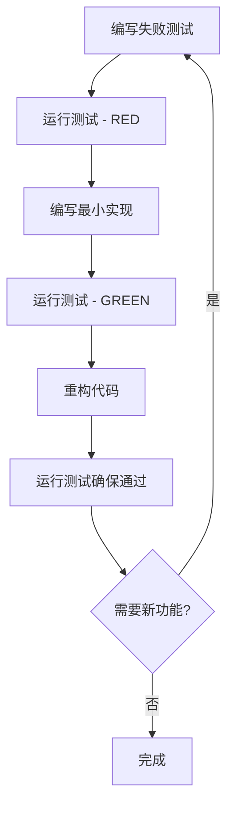

# 🎯 语言学习平台开发规范文档

## 🎯 规范目标

基于SOLID、KISS、DRY、YAGNI原则，制定严格的工程规范，确保代码质量、可维护性和可扩展性。

**原则执行要求：**
- **KISS (简单至上)：** 每个组件单一职责，避免复杂嵌套
- **YAGNI (精益求精)：** 只实现当前明确所需的功能
- **DRY (杜绝重复)：** 抽象共通逻辑，建立复用组件
- **SOLID原则：** 遵循面向对象设计原则

---

## 📁 项目结构规范

### 目录结构
```
src/
├── app/                    # Next.js App Router (页面路由)
├── components/             # 可复用组件
│   ├── ui/                # 基础UI组件
│   ├── features/          # 功能组件
│   └── layout/            # 布局组件
├── lib/                   # 工具库和类型
│   ├── types/             # TypeScript类型定义
│   ├── utils/             # 工具函数
│   ├── data/              # 数据文件和处理
│   ├── hooks/             # 自定义React Hooks
│   └── __mocks__/         # Mock数据
└── styles/                # 样式文件
```

### 文件命名规范
- **组件文件**: PascalCase (如 `LanguageCard.tsx`)
- **工具函数**: kebab-case (如 `data-validation.ts`)
- **类型定义**: kebab-case (如 `language-types.ts`)
- **常量文件**: SCREAMING_SNAKE_CASE (如 `API_CONSTANTS.ts`)
- **测试文件**: `*.test.{ts,tsx}` 或 `*.spec.{ts,tsx}`

---

## 🔧 TypeScript开发规范

### 基础配置
```json
{
  "compilerOptions": {
    "strict": true,
    "noImplicitAny": true,
    "noImplicitReturns": true,
    "noImplicitThis": true,
    "noUnusedLocals": true,
    "noUnusedParameters": true
  }
}
```

### 类型定义规范

#### ✅ 推荐做法
```typescript
// 使用接口定义对象结构
interface Language {
  readonly id: string;
  readonly name: string;
  readonly difficulty: FSICategory;
  readonly region: string;
}

// 使用联合类型定义枚举值
type FSICategory = 1 | 2 | 3 | 4 | 5 | 6;

// 使用泛型提高复用性
interface ApiResponse<T> {
  data: T;
  success: boolean;
  message?: string;
}

// 使用工具类型处理复杂类型
type PartialLanguage = Partial<Language>;
type LanguageUpdate = Pick<Language, 'name' | 'difficulty'>;
```

#### ❌ 避免做法
```typescript
// ❌ 使用any类型
const data: any = {};

// ❌ 隐式any
function processData(data) {
  return data;
}

// ❌ 过度复杂的类型定义
type ComplexType<T, U, V> = T extends U ? V extends string ? T : U : never;
```

### 函数和方法规范

#### 函数签名
```typescript
// ✅ 明确的参数和返回值类型
function calculateDifficulty(
  languages: Language[],
  category: FSICategory
): number {
  return languages
    .filter(lang => lang.difficulty === category)
    .length / languages.length;
}

// ✅ 使用可选参数和默认值
function formatLanguageName(
  name: string, 
  options: {
    uppercase?: boolean;
    includeRegion?: boolean;
  } = {}
): string {
  const { uppercase = false, includeRegion = false } = options;
  // Implementation
}
```

### 错误处理规范
```typescript
// ✅ 使用Result模式处理错误
type Result<T, E = Error> = 
  | { success: true; data: T }
  | { success: false; error: E };

async function fetchLanguages(): Promise<Result<Language[]>> {
  try {
    const languages = await api.getLanguages();
    return { success: true, data: languages };
  } catch (error) {
    return { success: false, error: error as Error };
  }
}
```

---

## ⚛️ React组件开发规范

### 组件架构原则

#### 单一职责原则 (SRP)
```typescript
// ✅ 职责单一的组件
interface LanguageCardProps {
  language: Language;
  onSelect: (id: string) => void;
}

const LanguageCard: React.FC<LanguageCardProps> = ({ 
  language, 
  onSelect 
}) => {
  return (
    <div className="language-card" onClick={() => onSelect(language.id)}>
      <h3>{language.name}</h3>
      <p>难度: {language.difficulty}</p>
    </div>
  );
};

// ❌ 职责混杂的组件
const LanguageComponent = () => {
  // 包含数据获取、状态管理、UI渲染等多个职责
};
```

#### 开闭原则 (OCP)
```typescript
// ✅ 可扩展的组件设计
interface BaseCardProps {
  className?: string;
  children: React.ReactNode;
}

const Card: React.FC<BaseCardProps> = ({ className, children }) => (
  <div className={cn("card-base", className)}>
    {children}
  </div>
);

// 扩展而非修改
const LanguageCard: React.FC<{ language: Language }> = ({ language }) => (
  <Card className="language-card">
    <h3>{language.name}</h3>
    <p>难度: {language.difficulty}</p>
  </Card>
);
```

### 组件结构规范
```typescript
// 标准组件模板
interface ComponentNameProps {
  // 必需属性在前
  requiredProp: string;
  requiredCallback: (value: string) => void;
  
  // 可选属性在后
  optionalProp?: number;
  className?: string;
  children?: React.ReactNode;
}

const ComponentName: React.FC<ComponentNameProps> = ({
  requiredProp,
  requiredCallback,
  optionalProp = 0,
  className,
  children
}) => {
  // 1. Hooks调用
  const [state, setState] = useState<StateType>(initialState);
  const { data, error } = useCustomHook();
  
  // 2. 事件处理函数
  const handleClick = useCallback((event: MouseEvent) => {
    event.preventDefault();
    requiredCallback(requiredProp);
  }, [requiredProp, requiredCallback]);
  
  // 3. 副作用
  useEffect(() => {
    // Effect logic
  }, [dependency]);
  
  // 4. 早期返回条件
  if (error) {
    return <ErrorComponent message={error.message} />;
  }
  
  if (!data) {
    return <LoadingComponent />;
  }
  
  // 5. 主要JSX返回
  return (
    <div className={cn("component-base", className)}>
      {children}
    </div>
  );
};

// 默认导出和命名导出
export { ComponentName };
export default ComponentName;
```

### 自定义Hook规范
```typescript
// ✅ 单一职责的Hook
function useLanguageData(filters: LanguageFilters) {
  const [languages, setLanguages] = useState<Language[]>([]);
  const [loading, setLoading] = useState(true);
  const [error, setError] = useState<Error | null>(null);
  
  useEffect(() => {
    fetchLanguages(filters)
      .then(setLanguages)
      .catch(setError)
      .finally(() => setLoading(false));
  }, [filters]);
  
  return { languages, loading, error };
}

// ✅ 业务逻辑抽象
function useLanguageSelection() {
  const [selectedLanguages, setSelectedLanguages] = useState<string[]>([]);
  
  const toggleLanguage = useCallback((languageId: string) => {
    setSelectedLanguages(prev => 
      prev.includes(languageId)
        ? prev.filter(id => id !== languageId)
        : [...prev, languageId]
    );
  }, []);
  
  return { selectedLanguages, toggleLanguage };
}
```

---

## 🎨 CSS样式编写规范

### Tailwind CSS + BEM混合规范

#### 基本原则
1. **优先使用Tailwind工具类**用于基础样式
2. **使用BEM命名**处理复杂组件样式
3. **组件级CSS Modules**用于特殊样式

#### 样式组织结构
```typescript
// ✅ Tailwind为主的样式
const LanguageCard = ({ language, selected }) => (
  <div className={cn(
    // 基础样式 - Tailwind
    "p-4 rounded-lg shadow-md transition-all duration-200",
    // 状态样式 - 条件类名
    selected && "ring-2 ring-blue-500 bg-blue-50",
    // 悬停效果
    "hover:shadow-lg hover:scale-105"
  )}>
    <h3 className="text-xl font-semibold text-gray-900">{language.name}</h3>
    <p className="text-sm text-gray-600 mt-2">难度: {language.difficulty}</p>
  </div>
);

// ✅ 复杂组件使用BEM + CSS Modules
// language-list.module.css
.languageList {
  @apply grid gap-4;
  grid-template-columns: repeat(auto-fill, minmax(280px, 1fr));
}

.languageList__item {
  @apply relative;
}

.languageList__item--selected {
  @apply ring-2 ring-blue-500;
}

.languageList__item--loading {
  @apply opacity-50 pointer-events-none;
}
```

#### 响应式设计规范
```typescript
// 使用统一的断点系统
const breakpoints = {
  sm: '640px',   // 小屏幕
  md: '768px',   // 平板
  lg: '1024px',  // 笔记本
  xl: '1280px',  // 桌面
  '2xl': '1536px' // 大屏
};

// ✅ Mobile-first响应式设计
const ResponsiveComponent = () => (
  <div className={cn(
    // 移动端基础样式
    "p-4 space-y-4",
    // 平板样式
    "md:p-6 md:space-y-6 md:grid md:grid-cols-2 md:gap-6",
    // 桌面样式  
    "lg:p-8 lg:grid-cols-3 lg:gap-8",
    // 大屏样式
    "xl:grid-cols-4 xl:gap-10"
  )}>
    {/* Content */}
  </div>
);
```

#### 颜色和主题规范
```typescript
// tailwind.config.ts 颜色系统
const colors = {
  // FSI 6色系统
  fsi: {
    1: '#22C55E', // 绿色 - 最简单
    2: '#84CC16', // 浅绿
    3: '#EAB308', // 黄色
    4: '#F97316', // 橙色
    5: '#EF4444', // 红色
    6: '#DC2626', // 深红 - 最难
  },
  // 语义化颜色
  semantic: {
    success: '#22C55E',
    warning: '#EAB308', 
    error: '#EF4444',
    info: '#3B82F6',
  }
};
```

---

## 🧪 测试规范和策略

### 测试层次结构
```
测试金字塔:
    E2E Tests (5%) - Cypress
         ↑
    Integration Tests (15%) - React Testing Library  
         ↑
    Unit Tests (80%) - Jest
```

### 单元测试规范 (AAA模式)

#### 测试文件结构
```typescript
// language.test.ts
describe('Language Utils', () => {
  describe('calculateDifficulty', () => {
    // Arrange - 准备测试数据
    const mockLanguages: Language[] = [
      { id: '1', name: 'Spanish', difficulty: 1, region: 'Europe' },
      { id: '2', name: 'Chinese', difficulty: 5, region: 'Asia' },
    ];

    it('should calculate average difficulty correctly', () => {
      // Arrange
      const expectedAverage = 3;

      // Act  
      const result = calculateDifficulty(mockLanguages);

      // Assert
      expect(result).toBe(expectedAverage);
    });

    it('should handle empty array', () => {
      // Arrange
      const emptyArray: Language[] = [];

      // Act & Assert
      expect(() => calculateDifficulty(emptyArray)).toThrow('Empty array');
    });
  });
});
```

#### React组件测试规范
```typescript
// LanguageCard.test.tsx
import { render, screen, fireEvent } from '@testing-library/react';
import { LanguageCard } from './LanguageCard';
import { mockLanguage } from '@/lib/__mocks__/test-data';

describe('LanguageCard', () => {
  const defaultProps = {
    language: mockLanguage,
    onSelect: jest.fn(),
  };

  beforeEach(() => {
    jest.clearAllMocks();
  });

  it('should render language information correctly', () => {
    // Arrange & Act
    render(<LanguageCard {...defaultProps} />);

    // Assert
    expect(screen.getByText(mockLanguage.name)).toBeInTheDocument();
    expect(screen.getByText(`难度: ${mockLanguage.difficulty}`)).toBeInTheDocument();
  });

  it('should call onSelect when clicked', () => {
    // Arrange
    render(<LanguageCard {...defaultProps} />);
    const card = screen.getByRole('button');

    // Act
    fireEvent.click(card);

    // Assert
    expect(defaultProps.onSelect).toHaveBeenCalledWith(mockLanguage.id);
  });

  it('should handle loading state', () => {
    // Arrange & Act
    render(<LanguageCard {...defaultProps} loading />);

    // Assert
    expect(screen.getByTestId('loading-spinner')).toBeInTheDocument();
  });
});
```

### 测试数据管理
```typescript
// test-data.ts - 统一测试数据管理
export const mockLanguage: Language = {
  id: 'test-1',
  name: 'Test Language',
  difficulty: 3,
  region: 'Test Region',
  familyId: 'test-family',
  speakers: 1000000,
  resources: []
};

export const mockLanguages: Language[] = [
  mockLanguage,
  {
    id: 'test-2', 
    name: 'Another Language',
    difficulty: 1,
    region: 'Europe',
    familyId: 'indo-european',
    speakers: 500000,
    resources: []
  }
];

// 测试工厂函数
export const createMockLanguage = (overrides: Partial<Language> = {}): Language => ({
  ...mockLanguage,
  ...overrides
});
```

### E2E测试规范
```typescript
// language-search.cy.ts
describe('Language Search Feature', () => {
  beforeEach(() => {
    cy.visit('/languages');
  });

  it('should filter languages by difficulty', () => {
    // Given - 用户在语言页面
    cy.get('[data-testid="difficulty-filter"]').should('be.visible');

    // When - 用户选择难度过滤器
    cy.get('[data-testid="difficulty-1"]').click();

    // Then - 只显示难度为1的语言
    cy.get('[data-testid="language-card"]')
      .should('have.length.greaterThan', 0)
      .each(($card) => {
        cy.wrap($card).should('contain', '难度: 1');
      });
  });
});
```

---

## 🚀 MVP功能开发计划

### 开发优先级和时间估算

#### Phase 1: 核心数据展示 (2周)
```typescript
// 优先级: 🔴 高
interface MVP1Features {
  languageList: {
    display: '语言列表展示';
    filter: 'FSI难度过滤';
    search: '名称搜索';
    estimated: '5天';
  };
  
  languageDetail: {
    display: '语言详情页面'; 
    info: '基本信息展示';
    resources: '学习资源链接';
    estimated: '4天';
  };
  
  dataVisualization: {
    chart: '难度分布图表';
    statistics: '统计信息';
    estimated: '3天';
  };
}
```

#### Phase 2: 交互功能 (2周)
```typescript  
// 优先级: 🟡 中
interface MVP2Features {
  userRecommendation: {
    quiz: '语言推荐测试';
    result: '个性化推荐';
    estimated: '6天';
  };
  
  comparison: {
    select: '语言对比选择';
    table: '对比结果展示';
    estimated: '4天';
  };
}
```

#### Phase 3: 优化提升 (1周)
```typescript
// 优先级: 🟢 低  
interface MVP3Features {
  performance: {
    lazy: '懒加载优化';
    cache: '数据缓存';
    estimated: '3天';
  };
  
  accessibility: {
    a11y: '无障碍优化';
    seo: 'SEO优化';
    estimated: '2天';
  };
}
```

### TDD开发流程


### 每日开发节奏
```typescript
interface DailyWorkflow {
  morning: {
    review: '检查昨日代码和测试';
    planning: '制定当日开发任务';
    duration: '30分钟';
  };
  
  development: {
    tdd: '测试驱动开发循环';
    commit: '小步提交，频繁集成';
    duration: '6小时';
  };
  
  evening: {
    review: '代码审查和质量检查';
    documentation: '更新技术文档';
    duration: '1小时';
  };
}
```

### 代码质量门禁
```typescript
interface QualityGates {
  preCommit: {
    lint: 'ESLint检查通过';
    format: 'Prettier格式化';
    typeCheck: 'TypeScript类型检查';
    unitTest: '单元测试全部通过';
  };
  
  preMerge: {
    coverage: '测试覆盖率 ≥ 90%';
    build: '构建成功';
    e2eTest: 'E2E测试通过';
    performance: 'Lighthouse评分 ≥ 90';
  };
  
  preRelease: {
    securityCheck: '安全扫描通过';
    accessibilityTest: 'A11y测试通过';
    crossBrowser: '跨浏览器测试';
    loadTest: '性能压力测试';
  };
}
```

---

## 📝 文档规范

### JSDoc注释规范
```typescript
/**
 * 计算语言学习的难度评分
 * @param languages - 语言数组
 * @param userProfile - 用户背景信息  
 * @param options - 计算选项
 * @returns 难度评分对象
 * @throws {ValidationError} 当输入参数无效时抛出
 * @example
 * ```typescript
 * const score = calculateDifficultyScore(
 *   languages,
 *   { nativeLanguage: 'English', experience: 'beginner' },
 *   { includeDialects: false }
 * );
 * ```
 * @since v1.0.0
 * @author Development Team
 */
function calculateDifficultyScore(
  languages: Language[],
  userProfile: UserProfile,
  options: CalculationOptions = {}
): DifficultyScore {
  // Implementation
}
```

### 技术文档更新流程
```typescript
interface DocumentationWorkflow {
  codeChange: {
    trigger: '代码变更自动检测';
    analysis: '影响范围分析';
    notification: '相关文档更新提醒';
  };
  
  updateProcess: {
    priority: '根据变更重要性排序';
    assignment: '指派给相应负责人';
    review: '文档审查和质量检查';
  };
  
  synchronization: {
    versioning: '文档版本与代码版本同步';
    deployment: '文档网站自动部署';
    notification: '团队变更通知';
  };
}
```

---

## 🔍 代码审查规范

### 审查检查清单
```typescript
interface CodeReviewChecklist {
  functionality: {
    requirements: '✅ 功能需求完全满足';
    edgeCases: '✅ 边界情况处理完整';
    errorHandling: '✅ 错误处理机制健全';
  };
  
  codeQuality: {
    solid: '✅ SOLID原则遵循';
    naming: '✅ 命名清晰语义化';
    complexity: '✅ 复杂度控制在合理范围';
    duplication: '✅ 无重复代码';
  };
  
  testing: {
    coverage: '✅ 测试覆盖率达标';
    quality: '✅ 测试用例质量高';
    automation: '✅ 自动化测试覆盖';
  };
  
  performance: {
    optimization: '✅ 性能优化到位';
    memory: '✅ 内存使用合理';
    rendering: '✅ 渲染性能优化';
  };
  
  security: {
    validation: '✅ 输入验证完整';
    authorization: '✅ 权限检查严格';
    dataProtection: '✅ 敏感数据保护';
  };
}
```

---

## 🎯 成功标准和KPI

### 技术指标
```typescript
interface TechnicalKPIs {
  quality: {
    testCoverage: 'target: ≥90%';
    codeComplexity: 'target: ≤10 (Cyclomatic)';
    techDebt: 'target: ≤5% (SonarQube)';
    bugDensity: 'target: ≤2 bugs/KLOC';
  };
  
  performance: {
    lighthouse: 'target: ≥90分';
    loadTime: 'target: ≤2s (LCP)';
    interactivity: 'target: ≤100ms (FID)';
    stability: 'target: ≤0.1 (CLS)';
  };
  
  maintainability: {
    readability: 'target: A级 (Maintainability Index)';
    modularity: 'target: 高内聚低耦合';
    documentation: 'target: 100% API文档覆盖';
  };
}
```

### 开发效率指标
```typescript
interface ProductivityKPIs {
  development: {
    velocity: 'target: 稳定的迭代速度';
    quality: 'target: 低返工率 ≤10%';
    automation: 'target: 自动化测试覆盖 ≥80%';
  };
  
  collaboration: {
    codeReview: 'target: 24小时内完成审查';
    documentation: 'target: 同步更新率 100%';
    knowledge: 'target: 团队技术栈统一';
  };
}
```

---

## ✅ 规范执行确认

**制定日期**: 2025年08月30日  
**适用版本**: v1.0.0+  
**审查周期**: 每月第一周  
**责任人**: 开发团队全体成员

**关键原则重申:**
- 🎯 **SOLID驱动**: 每个组件都要体现面向对象设计原则
- 🧪 **TDD优先**: 先写测试再写实现，保证代码质量  
- 📚 **文档同步**: 代码变更必须同时更新相关文档
- 🔍 **质量门禁**: 严格执行代码质量检查标准
- 🚀 **持续改进**: 定期回顾和优化开发流程

**执行检查**:
- ✅ 团队培训完成
- ✅ 工具配置统一  
- ✅ 检查清单建立
- ✅ 自动化流程设置

*遵循此规范将确保项目代码质量、可维护性和团队协作效率！* 🎯